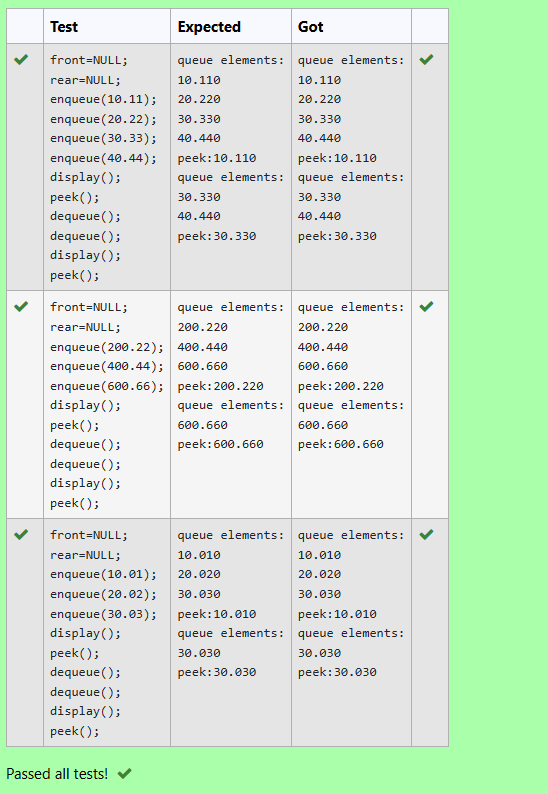

# 📚 Queue Using Linked List in C (with Double/Float Data)
This project demonstrates the implementation of a Queue using a Linked List in the C programming language, specifically for storing and managing float/double data.

## ✅ Aim
To develop a set of functions (enqueue, dequeue, peek, display) in C for performing queue operations using a linked list that holds floating-point (double) data.

## 🧱 Structure Definition
```
struct Node {
   float data;
   struct Node *next;
} *front = NULL, *rear = NULL;
```
front: Points to the first element of the queue.

rear: Points to the last element of the queue.

Each node stores a float (used as double) and a pointer to the next node.

## 🔧 Functions
### ✅ void enqueue(float data)
Adds an element to the rear of the queue.

### ✅ void dequeue()
Removes an element from the front of the queue.

### ✅ void peek()
Displays the value at the front of the queue.

### ✅ void display()
Prints all elements in the queue from front to rear.

## 🧪 Code
```
struct Node
{
   float data;
   struct Node *next;
}*front=NULL,*rear=NULL;
void enqueue(float data)
{
    struct Node *newnode=(struct Node*)malloc(sizeof(struct Node));
    newnode->data=data;
    newnode->next=NULL;
    if (rear==NULL){
        front=rear=newnode;
        return;
    }
    rear->next=newnode;
    rear=newnode;
}
void display()
{
    if (front==NULL){
        printf("queue is empty\n");
        return;
    }
    
    struct Node *temp=front;
    printf("queue elements:\n");
    while(temp!=NULL){
        printf("%.3f\n",temp->data);
        temp=temp->next;
    }
}
void dequeue()
{
    if (front==NULL){
        printf("Queue is Empty!!!");
        return;
    }
    struct Node *temp=front;
    if (front!=NULL){
        rear=NULL;
    }
    front=front->next;
    free(temp);
}
void peek()
{
    printf("peek:%.3f\n",front->data);
}
```

## ✅ Sample Output

## 📌 Notes
Queue follows FIFO (First-In, First-Out).

The float data is formatted to 3 decimal places (%.3f) for consistency.

Proper memory management is done using malloc and free.