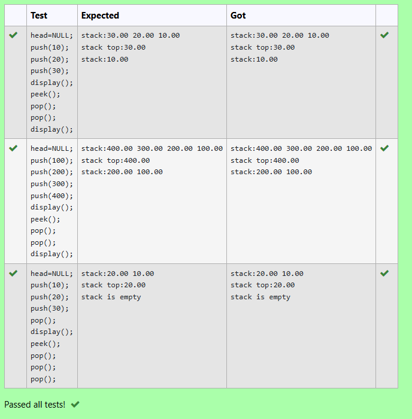

# 📚 Stack Using Linked List in C (for Float Data)
This project implements a Stack using a singly linked list in the C programming language to store and manage float values.

## ✅ Aim
To develop functions in C to perform the following stack operations using a linked list:

push() – Add a float value to the stack

pop() – Remove the top element from the stack

peek() – Display the top element without removing it

display() – Display all elements in the stack

## 🧠 Data Structure
```
struct Node {
    float data;
    struct Node *next;
} *head;
```
head points to the top of the stack.

Each node contains a float value and a pointer to the next node.

## 🔧 Functions
### ✅ void push(float data)
Adds a new float element to the top of the stack.

### ❌ void pop()
Removes the top element from the stack.

### 👁️ void peek()
Displays the top element of the stack without removing it.

### 📋 void display()
Prints all the elements in the stack from top to bottom.

## 💻 Code
```
struct Node   
{  
float data;  
struct Node *next;  
}*head;
void push(float data)  
{  
    struct Node *newnode=(struct Node*)malloc(sizeof(struct Node));
    newnode->data=data;
    newnode->next=head;
    head=newnode;
}  
void pop()  
{  
    if (head==NULL){
        printf("stack is empty");
        return;
    }
    head=head->next;
}  
void display()  
{  
    struct Node *temp=head;
    printf("stack:");
    while(temp!=NULL){
        printf("%.2f " ,temp->data);
        temp=temp->next;
    }
    printf("\n");
}  
void peek()
{
    printf("stack top:%.2f\n",head->data);
}
```
## ✅ Sample Output

## 📌 Notes
This is a Last-In-First-Out (LIFO) structure.

The top of the stack is always at the head of the linked list.

The code handles empty stack conditions gracefully.