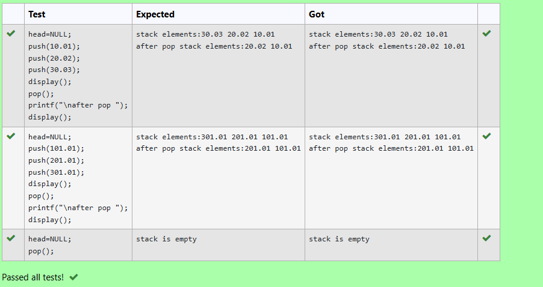

# 📚 Stack Implementation Using Linked List (with Float Data)
This program demonstrates how to implement a stack using a linked list in C, specifically for storing float values.

## ✅ Aim
To write a C program that uses a linked list to implement a stack, including push, pop, and display operations for float values.

## 🔧 Data Structure
```
struct Node {
    float data;
    struct Node *next;
} *head = NULL;
```
Each node holds a float value.

head points to the top of the stack.

## 🧠 Functions
### ✅ push(float value)
Pushes a float value onto the stack.

### ❌ pop()
Removes the top element from the stack.

### 👀 display()
Prints all elements in the stack.

## 💻 Code
```
struct Node   
{  
float data;  
struct Node *next;  
}*head;  
void pop()  
{ 
    if (head==NULL){
        printf("stack is empty");
        return;
    }
    struct Node *temp =head;
    head=temp->next;
    free(temp);
    
}
```
## 📤 Output

## 📌 Notes
This stack is implemented using singly linked list.

Top of the stack is at the head of the list.

Each pop() frees memory to avoid leaks.

